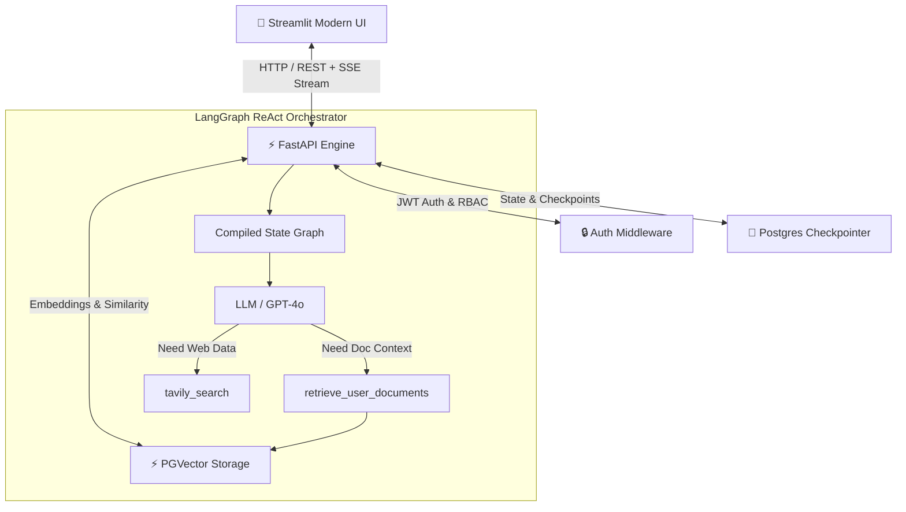
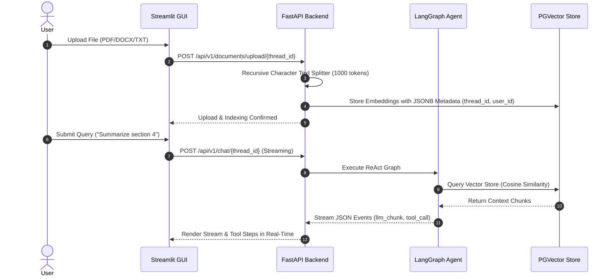

# 🧠 DocuMind: Enterprise Autonomous AI Document Intelligence & Knowledge Copilot

[](https://fastapi.tiangolo.com/)
[](https://python.langchain.com/docs/langgraph/)
[](https://github.com/pgvector/pgvector)
[](https://streamlit.io/)
[](https://opensource.org/licenses/MIT)

**DocuMind** is an enterprise-grade autonomous AI document intelligence and retrieval-augmented generation (RAG) platform. Powered by **FastAPI**, **LangGraph ReAct State Graphs**, **PostgreSQL + pgvector**, and **Streamlit**, DocuMind turns enterprise document repositories into real-time interactive intelligence.

[🌐 Live Demo](https://documind7.streamlit.app)

---

## 🌟 Key Capabilities

- 🤖 **Autonomous ReAct Agent Engine**: Dynamic decision matrix orchestrating semantic document retrieval and live web search via Tavily.
- ⚡ **End-to-End JSON Event Streaming**: Low-latency token-by-token streaming back to the client interface with intermediate tool call visualization.
- 🔒 **Multi-Tenant JWT Security & Isolation**: Granular user isolation across document vector stores, checkpointer memory states, and conversation threads.
- 📄 **Multi-Format Document Parsing**: High-speed ingestion for PDF, DOCX, and TXT files with recursive token chunking and metadata tracking.
- 🧠 **Persistent State Checkpointing**: Asynchronous Postgres state checkpointer (`langgraph-checkpoint-postgres`) preserving full chat history across sessions.
- 🎨 **Modern Dark Glassmorphism UI**: Bespoke Streamlit frontend featuring real-time stream rendering, expandable tool execution traces, and document management.

---

## 🏗️ System Architecture



---

## 🔄 RAG Ingestion & Query Execution Flow



---

## 💻 Tech Stack

| Component               | Technology               | Description                                                          |
| :---------------------- | :----------------------- | :------------------------------------------------------------------- |
| **Backend Framework**   | FastAPI (Python 3.12)    | Asynchronous, production-grade microservice architecture             |
| **Agent Engine**        | LangGraph & LangChain    | ReAct state graph compiler with custom tools and guardrails          |
| **Vector Store**        | PostgreSQL 16 + pgvector | HNSW/IVFFlat index vector storage with metadata filtering            |
| **Memory Checkpointer** | AsyncPostgresSaver       | Asynchronous state persistence for multi-thread retention            |
| **Frontend UI**         | Streamlit                | Custom dark glassmorphism styling with real-time SSE stream handling |
| **Security**            | OAuth2 + JWT (HS256)     | Password hashing (Bcrypt), token refresh, per-tenant data scoping    |
| **Containerization**    | Docker & Docker Compose  | Multi-container orchestrated deployment pipeline                     |

---

## 📦 Quick Start (Docker Compose)

### 1. Environment Setup

Copy the environment template and configure your API keys:

```bash
cp env.example .env
```

Key `.env` configuration:

```env
OPENAI_API_KEY=your_openai_api_key_here
TAVILY_API_KEY=your_tavily_api_key_here
POSTGRES_DATABASE=documind_db
PGVECTOR_COLLECTION_NAME=documind_embeddings
```

### 2. Launch Full Stack

Start the containerized stack using Docker Compose:

```bash
docker compose up --build -d
```

### 3. Verify Endpoints

- **Frontend Workspace**: [http://localhost:8501](http://localhost:8501)

---

## 🧰 Local Manual Development

### Backend Service (FastAPI)

```bash
cd backend
python -m venv .venv
# Activate virtual environment
source .venv/bin/activate  # Linux/macOS
# .venv\Scripts\activate   # Windows

pip install -r requirements.txt
uvicorn app.main:app --reload --host 0.0.0.0 --port 8000
```

### Frontend Workspace (Streamlit)

```bash
cd frontend
python -m venv .venv
source .venv/bin/activate  # Linux/macOS
# .venv\Scripts\activate   # Windows

pip install -r requirements.txt
streamlit run gui/main.py
```

---

## 📡 Streaming JSON Event Protocol

DocuMind uses newline-delimited SSE JSON events to deliver real-time agent feedback:

```json
{"type": "tool_call", "name": "retrieve_user_documents", "args": {"query": "contract termination terms"}}
{"type": "tool_result", "name": "retrieve_user_documents", "content": "[Chunk 1: Document Section 4.2...]"}
{"type": "llm_chunk", "content": "According to the contract, termination requires 30 days notice..."}
```

---

## 🛠️ API Reference Catalog

| Category      | Endpoint                               | Method | Description                               |
| :------------ | :------------------------------------- | :----- | :---------------------------------------- |
| **Auth**      | `/api/v1/auth/signup`                  | `POST` | Register workspace account                |
| **Auth**      | `/api/v1/auth/login`                   | `POST` | Authenticate & obtain JWT tokens          |
| **Threads**   | `/api/v1/threads/`                     | `POST` | Create new conversation thread            |
| **Threads**   | `/api/v1/threads/`                     | `GET`  | List active user threads                  |
| **Documents** | `/api/v1/documents/upload/{thread_id}` | `POST` | Ingest and index PDF/DOCX/TXT file        |
| **Documents** | `/api/v1/documents/stats/{thread_id}`  | `GET`  | Retrieve indexing & document stats        |
| **Chat**      | `/api/v1/chat/{thread_id}`             | `POST` | Stream agent response with memory & tools |

---
